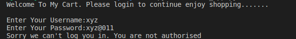
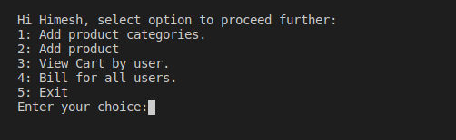
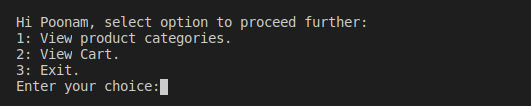

# MyCart

MyCart is a CLI Based cart application

# Run

Clone the folder at your end and run the script "python start_app.py" to start using this app,

# Note

Code is written in Ubuntu platform, so if anyone is using this script on windows machine.
Open the file "clear_screen.py" in folder "other" and comment line 4 and ucomment line 5.

# Usage

1: User needs to login to the system to perform the operations. 
2: Unauthorised user will not be allowed to Login. 
3: Authorised user will be classified in the basis of permission and the corresponding page will be loaded on the basis of user. 
4: Once authorise you can perform the operations 

# Screenshots

### Login Authentication

### Admin Panel

### Member Panel

